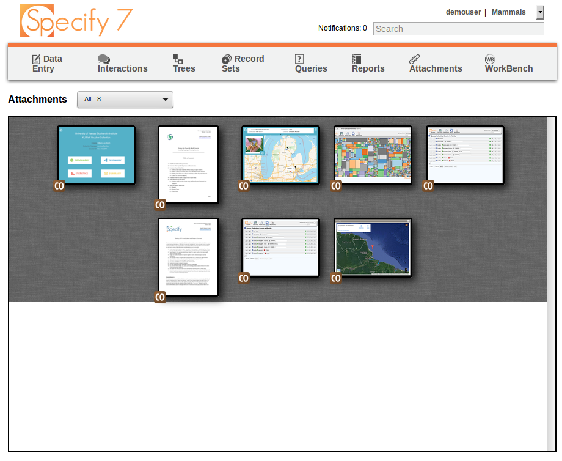

# Dockerized Specify

This repo contains materials to build a system with Specify 6 and 7 using Docker. The system allows running Specify 6 and Specify 7 in parallell with both being accessed through a web browser. Example scenarios where this project could be useful:

- Migrating data from earlier Specify versions using database dumps when switching to a newer Specify version (Specify 6 -> Specify 7 for example)
- Automatically load nightly backups into the system to verify that backups are OK
- Evaluations - deploy on a server to compare Specify 6 to Specify 7 for evaluation purposes

The composition of services that makes up this system also includes a media server and a report server.

## Requirements

The installation requires a docker host under your control - this can be either your own laptop or a production grade server but it needs to be a machine with the `docker` daemon running, see <https://docs.docker.com/engine/installation/>. You also need to install `docker-compose`, see <https://docs.docker.com/compose/install/> and `git` and `make`.

Having a local Java install is optional because Specify 6 has been webified using [novnc](https://github.com/novnc/noVNC).

The services are secured with [SSL](https://en.wikipedia.org/wiki/Secure_Sockets_Layer) which means a digital certificate is needed - preferrably a [wildcard certificate](https://en.wikipedia.org/wiki/Wildcard_certificate). 

If you are using SSL certs that you have acquired commercially and those are signed by a CA, put your files, ie `wildcardcert.crt` (here we use `recraft.me.crt`) and `wildcardcert.key` (here we use `recraft.me.key`) in the 'certs' -directory.

You can also choose to use a free self-signed digital certificate. For setting up SSL using a self-signed digital certificate, see Usage section below.

For name resolution to work - ie so that you can locally access services using their individual FQDNs (fully qualified domain names), make your system aware of the name resolver that will be launched by docker (as defined in the `docker-compose.yml` file in the `dnsmasq` section). 

On Linux this can be done by editing `/etc/resolvconf/resolv.conf.d/head`, adding this line:

		nameserver 172.17.0.1

Then restart `resolvconf` using this command:

		sudo systemctl restart resolvconf.service

For variations of how to do this on MacOS and other platforms, please search the Internet.

## Usage

The `docker-compose.yml` file defines the various components of the system. First make sure that you copy your certs into a `certs` directory or use the Makefile to generate self-signed certs (see separate section on that further down). Then use the `Makefile` which lists various useful targets providing shortcuts to use the composition of system services, for example you can build and start all services locally with: 

		make

On success, services will be available at:

		https://specify7.recraft.me
		https://specify6.recraft.me
		https://media.recraft.me
		https://reports.recraft.me

If running for the first time, the database will be loaded with data from the data.sql file (which the Makefile init target automatically downloads from SRC_DATA which is a demo dataset from Kansas available from GitHub, see the Makefile for details).

The db dump takes a while to load, so some patience is needed. The initial start of the db needs to complete before the UI starts, which "wait-for-it.sh" in the Specify 6 container takes care of (it waits for approximately a minute for the db to become available).

## Certificates and setting up SSL

If you are using SSL certs that you have acquired commercially and those are signed by a CA, put your files, ie shared.crt (recraft.me.crt) and shared.key (recraft.me.key) in the 'certs' -directory.

You can also generate self-signed certs. Detailed steps:

		# to generate self-signed certs use
		make ssl-certs

		# inspect ssl cert in use with
		make ssl-certs-show

### Commercial certs

If you have bought certs, put them in the certs directory and do NOT run `make ssl-certs` again, as that would overwrite those files.

If you bought certs, you may have several files available:

		key.pem - your secret key originally used in your Certificate Signing Request
		cacert.pem - the Certificate Authority's chain of certs
		cert.pem - your signed (wildcard?) public cert

If so, then combine the last two files - the cacert.pem och cert.pem - into `combined.pem`. In the right order. Pls search Internet for instructions.

### Self-signed certs

Using self-signed certificates will require either the CA cert to be imported and installed either system-wide or in each of your apps. If you don't do this, apps will fail to request data using SSL (https).

So, besides configuring those certs for use in the backend services, you also need to:

- import the /tmp/certs/ca.pem file into Firefox/Chrome or other browsers or clients that you are using on the client side

Pls search for documentation on how to do it, for example:

<https://support.mozilla.org/en-US/questions/995117>

NB: For curl to work with self-signed certs, you need to provide '--cacert /tmp/certs/ca.pem' switch or SSL requests will fail. 

# Specify configuration

Here are some notes on how to log in to Specify 6 and 7 for the first time and information on the application configuration - such as files with settings.

### First time login to Specify 6

To login, in Specify 6 GUI, use the relevant user/pass credentials pair at the first login... if you use the demodata, please use `"demouser", "demouser"` for user/pass credentials and expect a schema upgrade to run which for the demo dataset, this takes some time, patience please!

If you do not know the credentials and you are an admin, to get to know the credentials, determine the username and password hash by using the "make get-s6-login" target in the Makefile...

At the login dialogue use "db" for the database server name, "specify6" for the database name and "ben" for the master user, unless you have other settings in your .env-file and in the s6init.sql file...

### First time login to Specify 7

Before the first login to Specify 7, first make sure the Specify 6 has updated the demodata schema to the latest Specify version. Otherwise logins will fail.

Then run "make s7-notifications" which adds a table to the database schema which is needed specifically by Specify 7 (but not by Specify 6).

Finally - after those steps - use the credentials above to login at <https://specify7.recraft.me> (normally `demouser/demouser`)

## Settings files for Specify 6 and Specify 7

Specify 6 stores some settings in local files, such as:

	- /root/Specify/user.properties

The `user.properties` needs to be updated with minimal settings that can be used on the initial run. This is done automatically in the Makefile `make init` target.

It seems like these entries should be valid, as default settings provided in the `user.properties` file in this repo:

		USE_GLOBAL_PREFS=true
		attachment.url=http\://media.recraft.me/web_asset_store.xml
		attachment.use_path=false
		attachment.key=test_attachment_key
		attachment.path=
		login.servers_selected=db
		login.dbdriver_selected=MySQL
		login.databases_selected=specify6
		login.port=3306
		login.databases=specify6
		login.servers=db
		login.rememberuser=false

Specify 7 stores settings in a file called `specify_settings.py`, such as:

		THICK_CLIENT_LOCATION = '/opt/Specify'
		DATABASE_NAME = 'specify6'
		DATABASE_HOST = 'db'
		DATABASE_PORT = '3306'
		MASTER_NAME = 'ben'
		MASTER_PASSWORD = 'ben'
		SCHEMA_LANGUAGE = 'en'
		WEB_ATTACHMENT_URL = "https://media.recraft.me/web_asset_store.xml"
		WEB_ATTACHMENT_KEY = 'test_attachment_key'
		WEB_ATTACHMENT_COLLECTION = None
		WEB_ATTACHMENT_REQUIRES_KEY_FOR_GET = False
		REPORT_RUNNER_HOST = 'report'
		REPORT_RUNNER_PORT = '8080'
		WB_UPLOAD_LOG_DIR = "/tmp/"
		ANONYMOUS_USER = None
		RAVEN_CONFIG = None
		ALLOW_SUPPORT_LOGIN = False
		SUPPORT_LOGIN_TTL = 300
		STATS_URL = "https://stats.specifycloud.org/capture"
		WB_UPLOAD_LOG_DIR = "/tmp/"
		DEPOSITORY_DIR = '/tmp/'
		NOTIFICATION_TTL_DAYS = 7

# Data migration

To backup and restore system state - for example to make use an existing database dump to load it into the system - example Makefile targets are provided.

To backup the system state use:

		make backup

To restore the system state use:

		make restore

The system state is kept in two places - the filesystem and in the database. The default latest backup files that are created at backup and used by default for restore use these names:

		specify-db-latest.sql.gz
		specify-files-latest.tgz

In addition, timestamped archives are created. You can adjust the Makefile if you need to use other filenames.

## TODO, QUESTIONS and ISSUES

### TODO

- Share files across ui containers using another container (smb-share mount or equiv)

### QUESTIONS

- Can the web asset server deal with audio files?
	* Yes, but there is no UI viewer currently
- What is the RAVEN_CONFIG setting?
	* It is for running Sentry (https://sentry.io) which helps with error reports
- How can I change the STATS_URL to local capture?
	* For Specify 7 use the settings file, for Specify 6 not sure how to do it
- Recommended WB_UPLOAD_LOG_DIR?
	* $HOME/webuploadlog
- What is the DEPOSITORY_DIR?
	* $HOME/webuploadlog/specify_depository; a location where exports and other such things for asynchronous download get stored. Currently this is only query result exports and DwCA exports.
- How to get rid of warnings from db: Add mysql_config_editor stuff from here? <http://stackoverflow.com/questions/20751352/suppress-warning-messages-using-mysql-from-within-terminal-but-password-written/22933056#22933056>

### ISSUES

- Clicking the "LifeMapper" button gives an error like "javax.media.opengl.GLException: Profiles [GL4bc, GL3bc, GL2, GLES1] not available on device null", no workaround found for that yet.
- Specify6 web: why does not Copy and Paste work?
