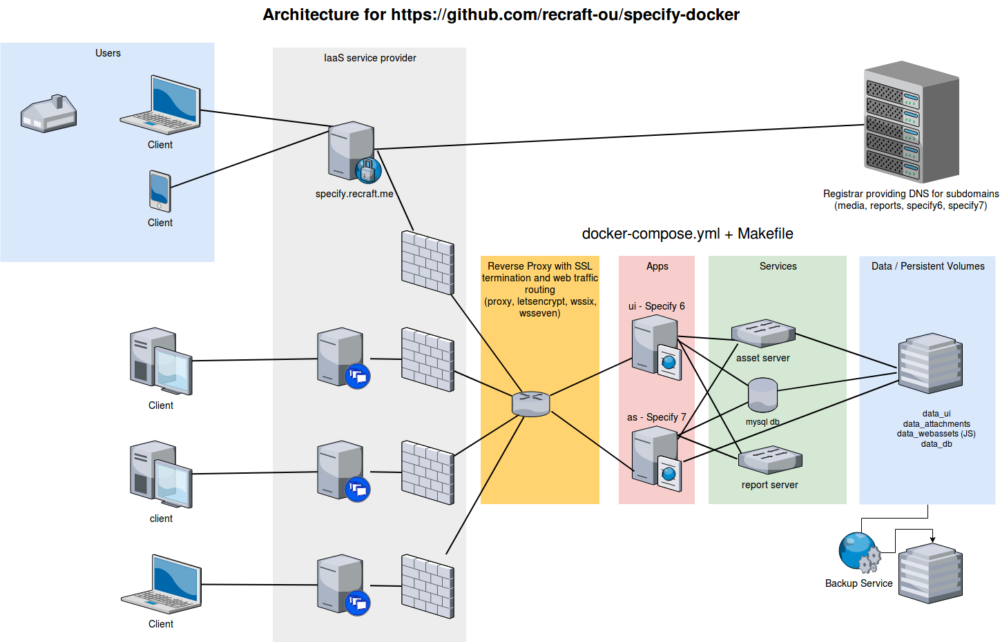
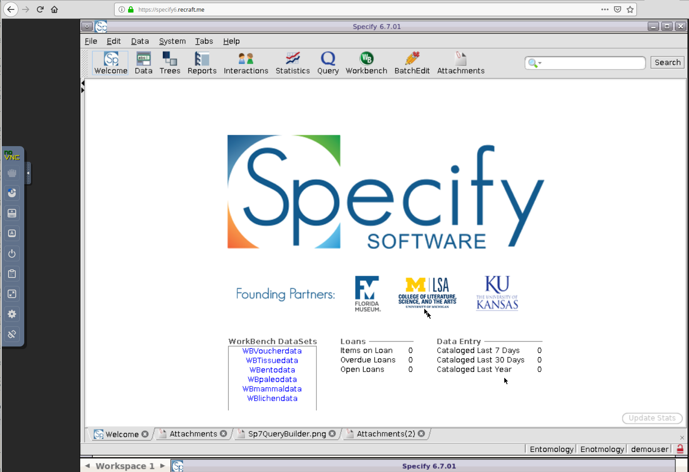
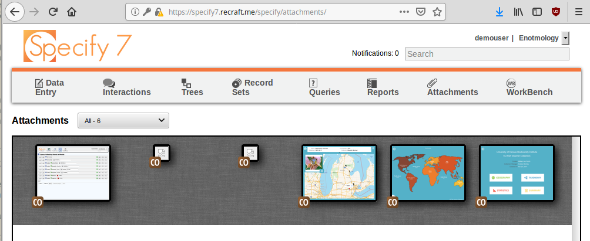

Technical description
---------------------

This project holds a dockerized service composition with Specify 6 and 7
including an asset server and a report server. Here is an overview of
this system:



The system components including relevant versioned images etc are listed
in the `docker-compose.yml` file and the commands to manage the system
are listed in the `Makefile`.

Screenshots
-----------



A webified version of Specify 6 can through NoVNC run in the browser.



The Specify 7 software is a native web application.

Source code and binaries
------------------------

Binaries:

<https://hub.docker.com/u/recraft>

Source code:

<https://github.com/recraft-ou/specify-docker>

Resource requirements
---------------------

While minimally requiring the equivalence of a single host cloud server
with low resources - such as minimally one VPS with 1G RAM, 1 CPU, 25Gb
SSD running an Ubuntu 18.04 x64 OS with at least 1G of swap space - a
more recommended setup would provide more resources.

One VPS server with **8 GB RAM and 4 vCPUs and 160 GB SSD storage**
provides plenty of resources with margins available for future growth of
data volumes.

While the monthly fees at Digital Ocean for the minimal server
environment mentioned above is only 5 USD, the recommended setup is
available for what is also a relatively reasonable reasonable cost of
about 40 USD per month.

In-house or cloud server?
-------------------------

Both options are possible. In both cases, when running services in a
cloud provided by an IaaS provider or locally on your own hardware and
network, you may want to consider how to automating the process of
setting up the production environment. Running locally, on your own
hardware, you would need to set up your server to run an OS such as
Ubuntu 18.04 and have the required tools such as `docker`,
`docker-compose`, `make` etc installed.

In general, when scaling the setup and running production systems in the
cloud you may need to bootstrap a cluster of docker nodes across a set
of service providers (using your own hardware and/or a set of cloud IaaS
providers). This can be automated, for example using the
`docker-machine` - a tool which can be installed from
<https://github.com/docker/machine/releases> and be used to remotely
control Docker machines and swarms or clusters of nodes running Docker
containers.

In this case, since the dockerized Specify installation runs nicely with
all services running on a single VPS, there is in most cases probably no
need for a cluster with many nodes, but the approach using
`docker-machine` works well regardless of number of nodes.

### In-house deployment

Using your own in-house infrastructure may make sense under certain
conditions:

-   Servers already exist and can be used at low or no cost
-   Network isolation is easy to achieve
-   People in operations are familiar with the technology stack (Linux
    OS, docker/docker-compose)

### Cloud deployment

Using an IaaS cloud provider to provision a VPS server can often be an
agile option especially in the case where in-house people are less
familiar with the technology stacks used, perhaps they are more focused
on corporate Microsoft-based stacks?

This option offers the following characteristics:

-   Can launch a new VPS in minutes with transparent costs with minimal
    lock-in (for example 40 USD / month and exit or move services at any
    time)
-   Tools and and APIs are often available to script the procedure
    (python-openstack for Open Stack-based cloud service providers and
    doctl for Digital Ocean for example)
-   Network isolation comes naturally (a breach in the local in-house
    network will not affect the cloud services and vice versa)
-   Plenty of guides are available to illustrate how to manage the
    setup, for example with regards to DNS and TLS/SSL settings
-   Enjoy existing support services, issue ticks and get help etc

For Swedish authorities the SUNET Cloud provides a good national option,
branded under the name SafeSpring: <https://www.safespring.com/>

Using Digital Ocean
===================

Here we illustrate steps needed to deploy Specify with a cloud setup
where we initially [use Docker Machine to provision a cluster node at
Digital Ocean](https://docs.docker.com/machine/drivers/digital-ocean/).

To do this, first we need a laptop and a CLI as well as an account at
Digital Ocean. At the CLI, ensure that `snap` is present since it is a
convenient way to install the `doctl` official command-line client from
Digital Ocean. This tool allows for enumerating valid values for
available images and regions.

``` bash

sudo apt install snapd
sudo snap install doctl --classic

# login using an API token that you have created at Digital Ocean's website
sudo doctl auth init

# list public distribution images that are available
sudo doctl compute image list-distribution --public
# do not use docker-18-04, this droplet won't communicate properly with docker-machine

# use the official Docker droplet from DO
sudo doctl compute region list
# ams3 is a valid European region value
```

To automate provisioning of a cluster node using `docker-machine`, we
need to specify which ssh key to use through its fingerprint and which
Digital Ocean API access token to use (that token needs to first be
generated from the website ), in addition to using relevant valid region
and image names.

``` bash
eval $(ssh-agent)
ssh-add ~/rekonstrukt/recraft-do

export DIGITALOCEAN_ACCESS_TOKEN="your_do_access_token_here"
export DIGITALOCEAN_SSH_KEY_FINGERPRINT="your_ssh_key_fingerprint_here:14:29:8a:13:63:20"
export DIGITALOCEAN_IMAGE="ubuntu-18-04-x64"
export DIGITALOCEAN_REGION="ams3"

# provision a node
docker-machine --debug create recraft \
  --driver digitalocean \
  --digitalocean-access-token $DIGITALOCEAN_ACCESS_TOKEN \
  --digitalocean-ssh-key-fingerprint $DIGITALOCEAN_SSH_KEY_FINGERPRINT \
  --digitalocean-image $DIGITALOCEAN_IMAGE \
  --digitalocean-region $DIGITALOCEAN_REGION
```

Once the node has been provisioned, shell access is available through
`docker-machine ssh recraft` and upgrades can be made through
`docker-machine upgrade recraft`.

Using Open Stack at SUNET Cloud (SafeSpring Compute)
====================================================

We start from scratch by provisioning a server in the Open Stack-based
SUNET Compute Cloud (SafeSpring).

Docs from SafeSpring are available
[here](https://docs.safespring.com/compute/getting-started/).

When using an OpenStack-based IaaS-provider, we’d use a Python-based
tool called `openstack` for accessing the OpenStack APIs from the CLI:

``` bash

# install python openstackclient

apt install python-openstackclient

# set up environment using  a file with these environment settings available from the
# openstack portal at https://dashboard.cloud.sunet.se/project/access_and_security/api_access/openrc/

source ~/Downloads/bas-infra1.nrm.se-openrc.sh

export OS_TENANT_ID=$OS_PROJECT_ID
export OS_DOMAIN_NAME=$OS_USER_DOMAIN_NAME
export OS_SECURITY_GROUPS="bioatlas-default"
export OS_FLOATINGIP_POOL="public-v4"
export OS_NETWORK_NAME="bioatlas-network"
#export OS_SSH_USER="ubuntu"
#export OS_PASSWORD="mysecretpassword"

# issue commands to enumerate resources

openstack network list
openstack flavor list
openstack ip floating pool list
openstack image list
openstack security group list
```

To automate provisioning of a cluster node using `docker-machine`, we
first need to make sure that we have ssh and docker ports open so add
TCP 2377 and TCP 2376 to the default security group in OpenStack. Then
you can proceed to create one or more nodes:

``` bash

docker-machine --debug create \
  --openstack-ssh-user "ubuntu" \
  --openstack-image-name "ubuntu-18.04 [20180517]" \
  --openstack-flavor-name "b.2xlarge" \
  -d "openstack" recraft-specify
```

For more information on how to provision the swarm, please see
<https://docs.docker.com/engine/swarm/swarm-tutorial/create-swarm/>.

Once the node(s) has been provisioned, shell access is available through
`docker-machine ssh recraft-specify` and upgrades can be made through
`docker-machine upgrade recraft-specify`.

Steps to deploy Specify
=======================

Now that we have a server properly prepared we need to deploy the
Specify system.

This could involve the following steps:

-   Login to the host, update and upgrade and install deps (make, unzip,
    docker-compose)
-   Set up firewall
-   Configure DNS and TLS/SSL
-   Copy the software to the host
-   Configure Specify settings
-   Schedule automated backups

More details now follow on those steps.

### Login to host

    docker-machine ssh recraft
    apt install make unzip
    curl -L "https://github.com/docker/compose/releases/download/1.23.1/docker-compose-$(uname -s)-$(uname -m)" -o /usr/local/bin/docker-compose
    chmod +x /usr/local/bin/docker-compose

### Activate firewall and allow ssh and web traffic

    ufw allow OpenSSH
    ufw allow http
    ufw allow https
    ufw enable
    ufw status

### Set up DNS and SSL

The `dnsmasq` component used on the development server doesn’t need to
run in production. Instead, to set up DNS, go to Loopia or equiv
registrar.

Here we assume using the domain name `recraft.me` so add
“specify.recraft.me” as a subdomain with a DNS A entry pointing to the
public ip that you get from the `docker-machine ip recraft` command. You
also need to add A entires (or CNAME entries) for the four subdomains
`media, reports, specify6, specify7` pointing to the same public IP.

An TLS/SSL cert needs to be present in the production environment, for
being able to use https. The `docker-compose.yml` file therefore needs a
bind mount for the proxy component and the certs need to be present in
the host’s `certs` directory.

This is automated by the `letsencrypt` service in the
`docker-compose.yml` file.

### Get the Specify software

Then do this to get the code that defines the specify-docker system onto
the server:

    mkdir -p repos
    cd repos
    git clone https://github.com/mskyttner/specify-docker.git
    cd specify-docker

Then change the credentials (held in the `.env`file which gets
referenced in the docker-compose.yml file) used for the production
environment.

### Configure Specify

There are three config files to go through. Some detail on configuration
settings are in the README.md file.

    # configure Specify settings for example with regards to domain names
    sed -i "s/infrabas\.se/recraft\.me/g" specify_settings.py
    sed -i "s/infrabas\.se/recraft\.me/g" user.properties
    sed -i "s/infrabas\.se/recraft\.me/g" web-asset-server/settings.py

Follow the instructions in README for first time use before logging in
to Specify 7.

### Launch services

While logged in on the host, build (if necessary) or start the system
directly by pulling images remotely from Docker Hub:

    make init 
    #make build
    make up

Note that starting the system for the first time takes considerable
time, several minutes, since the database data is loaded from a dump.

### Managing the system

Management of the system is provided through the Makefile targets. For
example:

    # set new password for novnc
    make set-s6-passwd NOVNCPASS=mynewpasswordforspecify6

    # run-once for Specify 7 
    make s7-notifications

### Backup and restore

On the host, add a crontab entry for making backups automatically:

    # schedule backups to run automatically using crontab
    # add these lines to crontab (crontab -e)
    # m h  dom mon dow   command
    30 4 * * * bash -c 'cd /root/repos/specify-docker && /usr/local/bin/docker-compose up -d media'
    45 4 * * * bash -c 'cd /root/repos/specify-docker && make backup'

Also verify that the Makefile restore target works.

### Migrating data

To load the system with existing Specify database dumps including media
assets, see the Makefile for some examples.

\`\`\`
